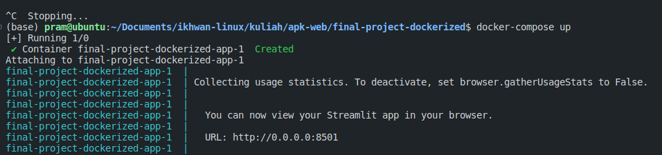

# Sistem Deteksi Penyakit Bercak Pada Daun Pisang Menggunakan Computer Vision dan Neural Networks

Aplikasi deteksi penyakit bercak menggunakan daun pisang dibuat menggunakan kombinasi antara model computer vision dan NN serta Streamlit sebagai front-end dan visualisasi.

Library yang digunakan dalam project ini yaitu:

```python
- streamlit==latest
- numpy==latest
- opencv-python==4.8.1.78
- tensorflow ==latest
```

Model di-train sebanyak 20 epoch menggunaka ResNet50. Anda bisa mengakses colab-nya [di sini](https://colab.research.google.com/drive/1wbCZdpoib3dkuqPJ9l50C8s0S8hKZxA2?usp=sharing).

## Deployment

Deployment project dapat dilakukan di localhost menggunakan Docker. Deployment menggunakan docker dilakukan agar tidak perlu menjalankan service secara berulang dan agar dapat memodifikasi port dari project. Selain itu, docker memudahkan jika nantinya project ingin di-deploy ke cloud based hosting.

## Cara Menjalankan Project

Clone repo ini

```
git clone https://github.com/prammmoe/web-final-docker.git
```

Download model yang telah di-train di [link ini]() (coming soon).

Jika ingin melakukan fine tuning, download dataset pada [link ini]() (coming soon).

Anda bisa mem-build image docker secara langsung menggunakan syntax

```
docker build -t streamlit
```

Atau menggunakan `docker-compose.yaml`

```
docker-compose up
```

Jika sudah, maka Anda bisa mengakses website pada localhost dengan host dan port seperti di bawah ini.


## Disclaimer

Project masih dalam tahap pengerjaan dan diperkirakan selesai pada awal Desember 2023.

Copyright @prammmoe all rights reserved.
